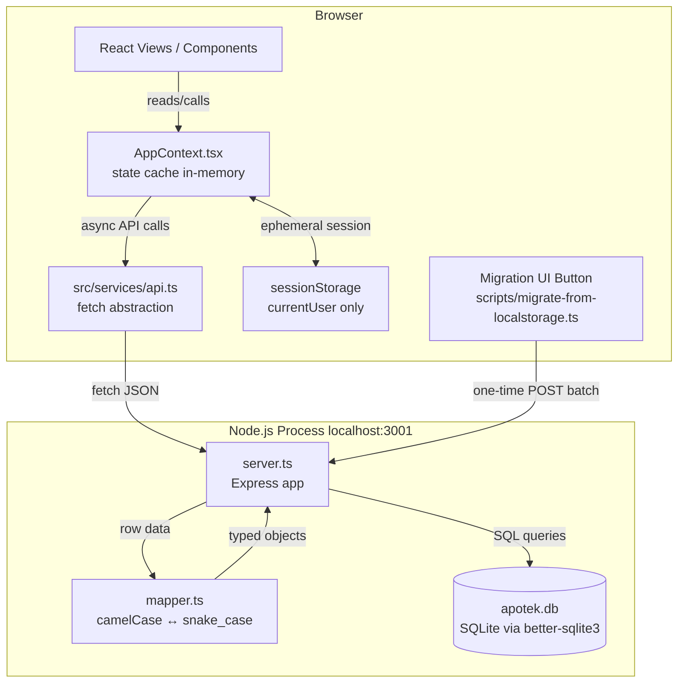
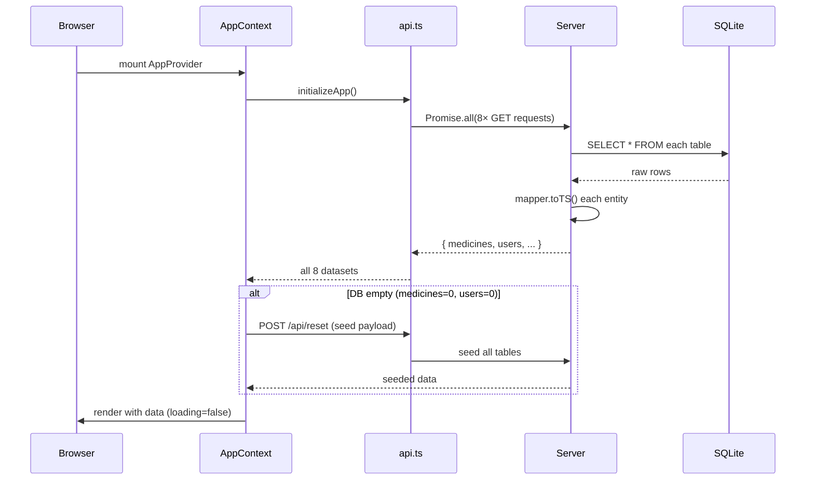
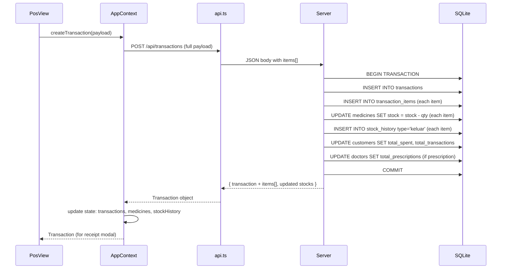
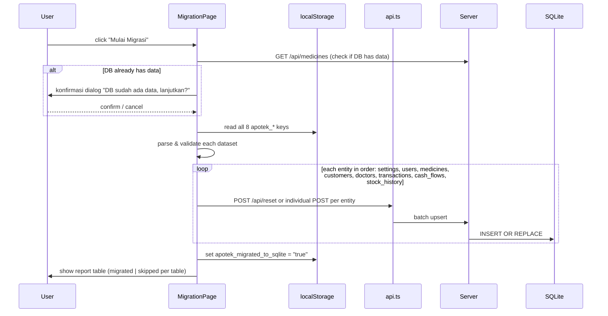

# Design Document: LocalStorage to SQLite Migration

## Overview

Migrasi arsitektur persistensi data aplikasi kasir apotek dari `localStorage` browser ke SQLite melalui Express HTTP API lokal. Frontend React tetap tidak berubah secara visual — hanya `AppContext.tsx` yang diganti dari synchronous localStorage reads/writes ke async API calls, dan state React tetap berfungsi sebagai in-memory cache.

Strategi inti: **satu sumber kebenaran (SQLite)**, **satu lapisan abstraksi HTTP (api.ts)**, **satu mapper konversi (mapper.ts)**. Tidak ada perubahan UI sama sekali.

---

## Architecture



---

## File / Module Structure (New Files Only)

```
kasir-apotik/
├── server.ts                          # Express server entry point
├── src/
│   └── services/
│       └── api.ts                     # API client (all fetch calls)
├── scripts/
│   └── migrate-from-localstorage.ts  # One-time migration runner (browser page)
└── apotek.db                          # SQLite file (gitignored, created at runtime)
```

**Modified files:**
- `src/context/AppContext.tsx` — replace all localStorage logic with API calls
- `package.json` — add `better-sqlite3`, `@types/better-sqlite3`, `concurrently`; add `dev:all` script

No new abstraction layers, no repositories, no service classes. `server.ts` is one flat file with route handlers.

---

## Data Flow Diagrams

### 1. App Initialization



### 2. createTransaction



### 3. One-Time Migration



---

## camelCase ↔ snake_case Mapper Design

Single file: `src/mapper.ts` (shared between `server.ts` import and potentially the migration script).

### Strategy

Generic key conversion via regex (`/([A-Z])/g` → `_$1.toLowerCase()`) handles ~95% of fields automatically. The asymmetric exceptions are handled with an explicit override map applied after the generic pass.

```typescript
// Explicit asymmetric overrides (TS camelCase → SQL snake_case)
const FIELD_OVERRIDES_TO_SQL: Record<string, string> = {
  user: 'user_name',           // StockHistory.user → stock_history.user_name
};

// Columns that are INTEGER 0/1 in SQLite but boolean in TypeScript
const BOOLEAN_COLUMNS = new Set([
  'is_active', 'is_prescription', 'is_ppn_included',
  'is_super_admin', 'is_ppn', 'auto_print_receipt',
]);
```

**`toSQL(obj)`**: camelCase keys → snake_case keys, `boolean` → `0|1`, applies `FIELD_OVERRIDES_TO_SQL`.

**`toTS(row)`**: snake_case keys → camelCase keys, `0|1` → `boolean` for `BOOLEAN_COLUMNS`, strips `transaction_items.id` (AUTOINCREMENT, excluded from `TransactionItem` type).

**Round-trip guarantee**: `toTS(toSQL(obj))` produces the same value for all non-optional fields defined in `src/types.ts`.

### TransactionItems handling

`GET /api/transactions` does a JOIN and builds the `items[]` array server-side before calling `toTS`. The AUTOINCREMENT `id` column of `transaction_items` is stripped in `toTS` since `TransactionItem` has no `id` field.

---

## API Endpoint Table

| Method | Path | Action | SQLite operation | Response |
|--------|------|--------|-----------------|----------|
| GET | `/api/settings` | Get settings | `SELECT * FROM settings WHERE id=1` | `{ success, data: PharmacySettings }` |
| PUT | `/api/settings` | Upsert settings | `INSERT OR REPLACE INTO settings` | `{ success, data: PharmacySettings }` |
| GET | `/api/users` | List users | `SELECT * FROM users` | `{ success, data: User[] }` |
| POST | `/api/users` | Add user | `INSERT INTO users` | `{ success, data: User }` |
| PUT | `/api/users/:id` | Update user | `UPDATE users SET ... WHERE id=?` | `{ success, data: User }` |
| DELETE | `/api/users/:id` | Delete user | Hard delete + super admin guard | `{ success }` |
| GET | `/api/medicines` | List medicines | `SELECT * FROM medicines` | `{ success, data: Medicine[] }` |
| POST | `/api/medicines` | Add medicine | `INSERT INTO medicines` | `{ success, data: Medicine }` |
| PUT | `/api/medicines/:id` | Update medicine | `UPDATE medicines SET ...` | `{ success, data: Medicine }` |
| DELETE | `/api/medicines/:id` | Soft/hard delete | Check refs → `is_active=0` or `DELETE` | `{ success }` |
| GET | `/api/customers` | List customers | `SELECT * FROM customers` | `{ success, data: Customer[] }` |
| POST | `/api/customers` | Add customer | `INSERT INTO customers` | `{ success, data: Customer }` |
| PUT | `/api/customers/:id` | Update customer | `UPDATE customers SET ...` | `{ success, data: Customer }` |
| DELETE | `/api/customers/:id` | Delete customer | Hard delete | `{ success }` |
| GET | `/api/doctors` | List doctors | `SELECT * FROM doctors` | `{ success, data: Doctor[] }` |
| POST | `/api/doctors` | Add doctor | `INSERT INTO doctors` | `{ success, data: Doctor }` |
| PUT | `/api/doctors/:id` | Update doctor | `UPDATE doctors SET ...` | `{ success, data: Doctor }` |
| DELETE | `/api/doctors/:id` | Delete doctor | Hard delete | `{ success }` |
| GET | `/api/transactions` | List transactions | JOIN transactions + transaction_items | `{ success, data: Transaction[] }` |
| POST | `/api/transactions` | Create transaction | Atomic: trx + items + stock + history + metrics | `{ success, data: Transaction }` |
| PUT | `/api/transactions/:id/cancel` | Cancel transaction | Atomic: status update + stock restore | `{ success, data: Transaction }` |
| GET | `/api/transactions/:id/items` | Get items for trx | `SELECT * FROM transaction_items WHERE transaction_id=?` | `{ success, data: TransactionItem[] }` |
| GET | `/api/stock_history` | List stock history | `SELECT * FROM stock_history ORDER BY date DESC` | `{ success, data: StockHistory[] }` |
| GET | `/api/cash_flows` | List cash flows | `SELECT * FROM cash_flows ORDER BY date DESC` | `{ success, data: CashFlow[] }` |
| POST | `/api/cash_flows` | Add cash flow | `INSERT INTO cash_flows` | `{ success, data: CashFlow }` |
| PUT | `/api/cash_flows/:id` | Update cash flow | `UPDATE cash_flows SET ...` | `{ success, data: CashFlow }` |
| DELETE | `/api/cash_flows/:id` | Delete cash flow | Hard delete | `{ success }` |
| POST | `/api/reset` | Reset + reseed | DELETE all rows + INSERT seed data (in transaction) | `{ success }` |

**Uniform response envelope:**
```typescript
type ApiResponse<T> = { success: true; data: T } | { success: false; error: string }
```

HTTP status codes: `200` success, `400` validation/business rule violation, `404` not found, `500` database/server error.

---

## Error Handling Strategy

### Server-side (`server.ts`)

Three error tiers, handled in a single `try/catch` per route:

```typescript
// ponytail: centralized error handler — one place covers all routes
app.use((err: unknown, req, res, next) => {
  if (err instanceof ValidationError) return res.status(400).json({ success: false, error: err.message });
  if (err instanceof BusinessRuleError) return res.status(400).json({ success: false, error: err.message });
  console.error(err);
  res.status(500).json({ success: false, error: 'Internal server error' });
});
```

| Error type | HTTP status | When |
|-----------|-------------|------|
| Input validation failure | 400 | Missing required fields, wrong format |
| Business rule violation | 400 | Duplicate username/code, delete super admin, cancel already-cancelled trx |
| SQLite UNIQUE/FK constraint | 400 | Caught from `better-sqlite3` error code `SQLITE_CONSTRAINT` |
| All other DB / runtime errors | 500 | Unexpected failures |

`better-sqlite3` is synchronous — no unhandled promise rejections. All errors surface as thrown exceptions inside `try/catch`.

### Client-side (`api.ts`)

```typescript
async function apiFetch<T>(path: string, options?: RequestInit): Promise<T> {
  let res: Response;
  try {
    res = await fetch(BASE_URL + path, options);
  } catch {
    throw new Error(`Server tidak dapat dijangkau di ${BASE_URL}. Pastikan server berjalan dengan: tsx server.ts`);
  }
  if (!res.ok) {
    const body = await res.json().catch(() => ({}));
    throw new Error(typeof body?.error === 'string' ? body.error : `HTTP ${res.status}`);
  }
  const body = await res.json();
  return body.data as T;
}
```

### AppContext error handling

- **Init failure**: set `apiError` state → render `<ErrorScreen>` with instructions, never render app with empty data.
- **Write failure**: catch in each action → show toast notification via existing `NotificationCenter`, do not mutate any of the 8 state collections.
- **No optimistic updates**: state only changes after a successful API response.

---

## Migration Script Design

**File**: `scripts/migrate-from-localstorage.ts`

**Delivery**: Rendered as a standalone HTML page served by the Express server at `GET /migrate`, or accessible via a button in `SettingsView.tsx` (admin-only).

### Migration Order (respects FK constraints)

```
1. settings        (no FK dependencies)
2. users           (no FK dependencies)
3. medicines       (no FK dependencies)
4. customers       (no FK dependencies)
5. doctors         (no FK dependencies)
6. transactions    (FK → customers, doctors)
7. transaction_items (FK → transactions, medicines)
8. stock_history   (FK → medicines)
9. cash_flows      (no FK dependencies)
```

### Algorithm

```typescript
async function migrate() {
  // 1. Read all localStorage keys
  const raw = {
    medicines:    safeParseLS('apotek_medicines', []),
    users:        safeParseLS('apotek_users', []),
    transactions: safeParseLS('apotek_transactions', []),
    customers:    safeParseLS('apotek_customers', []),
    doctors:      safeParseLS('apotek_doctors', []),
    stockHistory: safeParseLS('apotek_stock_history', []),
    cashFlows:    safeParseLS('apotek_cash_flows', []),
    settings:     safeParseLS('apotek_settings', null),
  };

  // 2. Check if DB already has data
  const existing = await api.getMedicines();
  if (existing.length > 0) {
    const confirmed = await confirmDialog('Database sudah ada data. Lanjutkan dan timpa?');
    if (!confirmed) { console.log('Migration aborted'); return; }
  }

  // 3. Use POST /api/reset with full payload (single atomic operation)
  //    This reuses the existing reset endpoint — no new endpoint needed.
  //    ponytail: reuse /api/reset rather than writing per-entity upsert logic

  // 4. Extract transaction_items from transaction.items[] into flat array
  //    (localStorage stores items embedded in transaction object)

  // 5. Skip items referencing unknown medicine IDs, log to console
  const medicineIds = new Set(raw.medicines.map(m => m.id));
  const validTxItems = allItems.filter(item => {
    if (!medicineIds.has(item.medicineId)) {
      console.warn(`WARN: skipped transaction_item — referenced medicine ${item.medicineId} not found`);
      return false;
    }
    return true;
  });

  // 6. POST /api/reset with full validated payload

  // 7. Print report table
  // 8. Set localStorage.setItem('apotek_migrated_to_sqlite', 'true')
}

function safeParseLS<T>(key: string, fallback: T): T {
  try { return JSON.parse(localStorage.getItem(key) ?? 'null') ?? fallback; }
  catch { return fallback; }
}
```

The migration uses `POST /api/reset` as the transport, since it already handles the full atomic reseed. No new endpoint needed.

---

## Startup / Dev Workflow

### Install new dependency

```bash
npm install better-sqlite3
npm install --save-dev @types/better-sqlite3 concurrently
```

### Run both servers

```bash
# package.json scripts addition:
"dev:server": "tsx server.ts",
"dev:all": "concurrently \"npm run dev\" \"npm run dev:server\""
```

```bash
npm run dev:all
# Vite   → http://localhost:3000
# Express → http://localhost:3001
```

### Environment (`.env`)

```
PORT=3001
DB_PATH=./apotek.db
```

### Server startup sequence

```
1. Load .env (dotenv)
2. Validate DB_PATH directory exists → exit(1) if not
3. Open better-sqlite3 connection
4. PRAGMA foreign_keys = ON
5. Run schema.sql DDL (CREATE TABLE IF NOT EXISTS — idempotent)
6. Print: "Server running on :3001 | DB: ./apotek.db | Tables ready"
7. Start listening on 127.0.0.1:3001
```

---

## Correctness Properties

These are the invariants the implementation must satisfy. Each maps directly to a testable assertion.

### P1 — Mapper round-trip (Requirement 3.6)

```typescript
// For all non-optional fields in src/types.ts
assert.deepStrictEqual(toTS(toSQL(medicine)), medicine)
assert.deepStrictEqual(toTS(toSQL(transaction)), transaction) // items[] excluded from this direction
```

### P2 — Boolean columns preserve semantics (Requirement 3.3 / 3.4)

```typescript
// For every row read from SQLite
assert(typeof row.isActive === 'boolean')
assert(typeof row.isPrescription === 'boolean')
assert(typeof row.isPpnIncluded === 'boolean')
assert(typeof row.isSuperAdmin === 'boolean')
assert(typeof row.autoPrintReceipt === 'boolean')
// For every object written to SQLite
assert(sqlRow.is_active === 0 || sqlRow.is_active === 1)
```

### P3 — Asymmetric field mapping (Requirement 3.7)

```typescript
const sqlRow = toSQL({ user: 'Rina', medicineId: 'med-1' } as Partial<StockHistory>)
assert(sqlRow.user_name === 'Rina')       // not 'user'
assert(sqlRow.medicine_id === 'med-1')    // normal camelCase rule
```

### P4 — Transaction atomicity: no partial writes (Requirement 6.1 / 6.2)

```typescript
// Simulate a DB error mid-transaction; then verify:
assert(db.prepare('SELECT COUNT(*) FROM transactions').get()['COUNT(*)'] === countBefore)
assert(db.prepare('SELECT COUNT(*) FROM transaction_items').get()['COUNT(*)'] === itemsBefore)
assert(db.prepare('SELECT stock FROM medicines WHERE id=?').get(medicineId).stock === stockBefore)
```

### P5 — Stock conservation across createTransaction (Requirement 6.1)

```typescript
// stockBefore = sum of all medicines.stock
// After POST /api/transactions with N items of qty Q each:
// stockAfter = stockBefore - sum(item.qty * item.unitMultiplier)
assert(stockAfter === stockBefore - totalUnitsDeducted)
```

### P6 — Stock conservation across cancelTransaction (Requirement 6.3)

```typescript
// After PUT /api/transactions/:id/cancel:
assert(medicine.stock === stockBeforeTransaction) // fully restored
```

### P7 — Cancel idempotency guard (Requirement 6.5)

```typescript
// Cancelling an already-cancelled transaction returns 400
const res = await fetch(`/api/transactions/${cancelledId}/cancel`, { method: 'PUT', ... })
assert(res.status === 400)
// DB state unchanged
assert(db.prepare('SELECT status FROM transactions WHERE id=?').get(cancelledId).status === 'Dibatalkan')
```

### P8 — initializeApp fetches all 8 in parallel (Requirement 4.5)

```typescript
// If any one of 8 fetches rejects, initializeApp() must reject (not resolve with partial data)
// Property: result is either ALL 8 datasets or an error — never 7 datasets + undefined
```

### P9 — Migration skips orphaned items (Requirement 7.5)

```typescript
// Given a transaction_item referencing medicine ID not in medicines table:
const report = await runMigration(lsData)
assert(report.transaction_items.skipped >= 1)
assert(!db_contains_item_with_unknown_medicine_id)
```

### P10 — TransactionItem excludes AUTOINCREMENT id (Requirement 3.5)

```typescript
// Items returned by GET /api/transactions must not have an 'id' field
const { items } = (await getTransactions())[0]
items.forEach(item => assert(!('id' in item)))
```

---

## Key Implementation Notes

**`better-sqlite3` synchronous advantage**: All DB calls in route handlers are synchronous. No `async/await` needed in route handlers — this eliminates an entire class of concurrency bugs and simplifies the atomicity guarantee (Requirement 6.6). The atomic transaction blocks are just:

```typescript
const runTransaction = db.transaction((payload) => {
  // all INSERT/UPDATE calls here — either all commit or all rollback
});
runTransaction(payload); // throws on failure, auto-rollbacks
```

**`GET /api/transactions` JOIN strategy**: Rather than N+1 queries, use one query with a LEFT JOIN and group items client-side (in JS after fetch):

```typescript
// ponytail: simple array grouping beats a complex query builder
const rows = db.prepare(`
  SELECT t.*, ti.medicine_id, ti.qty, ...
  FROM transactions t
  LEFT JOIN transaction_items ti ON ti.transaction_id = t.id
  ORDER BY t.date DESC
`).all();
// group by transaction id in JS
```

**`POST /api/reset` payload shape**:

```typescript
{
  settings: PharmacySettings,
  users: User[],
  medicines: Medicine[],
  customers: Customer[],
  doctors: Doctor[],
  transactions: Transaction[],  // items[] embedded, server extracts them
  stockHistory: StockHistory[],
  cashFlows: CashFlow[]
}
```

The reset handler wraps everything in one `db.transaction()` call: DELETE all rows in reverse FK order, then INSERT all seed data.

**`currentUser` in sessionStorage**: The login/logout logic in AppContext stays exactly as-is. `sessionStorage.setItem('apotek_active_user', ...)` replaces the current `localStorage.setItem` calls for this one key only.
